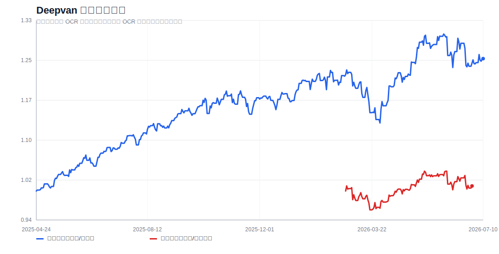

# Deepvan 组合展示面板

## 指标

| 组合 | 区间 | 净值 | 总收益 | 年化 | 年化波动 | 最大回撤 | Sharpe-like |
|---|---|---:|---:|---:|---:|---:|---:|
| 叫兽指数国际版/全球版 | 2025-04-24 ~ 2026-07-10 | 1.2527 | 25.27% | 20.45% | 9.45% | -8.22% | 2.16 |
| 叫兽指数内地版/代理口径 | 2026-02-24 ~ 2026-06-29 | 1.0097 | 0.97% | 2.87% | 9.11% | -4.54% | 0.32 |

## 口径

- 国际版：使用 OCR 完整持仓表和可取行情代理重建，已覆盖主要美股/港股 ETF 与个股。
- 内地版：使用图片 OCR 拆出的 2026-02-24、2026-03-09、2026-03-19 子模块；现金/短债按 0 收益，量化用 ASHR 代理，QDII 子池用 QQQ/DXJ/XLE 等代理。
- 2026-06-29 内地版仍有 75% `台美日韩港混合QDII` 合并桶，底层比例为自定义，因此不把 6/29 之后硬接成精确净值。
